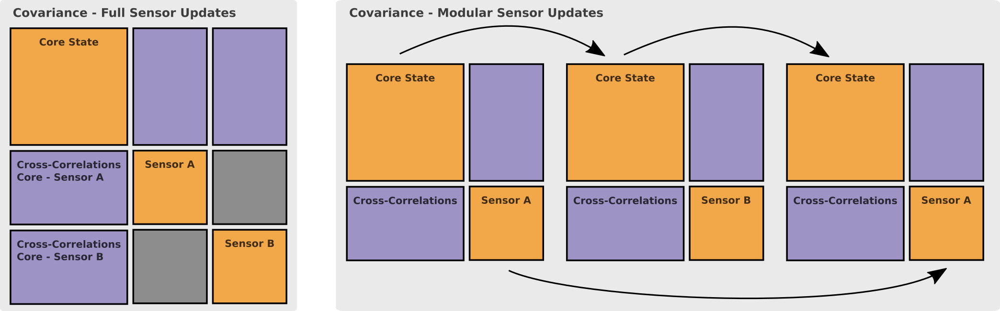
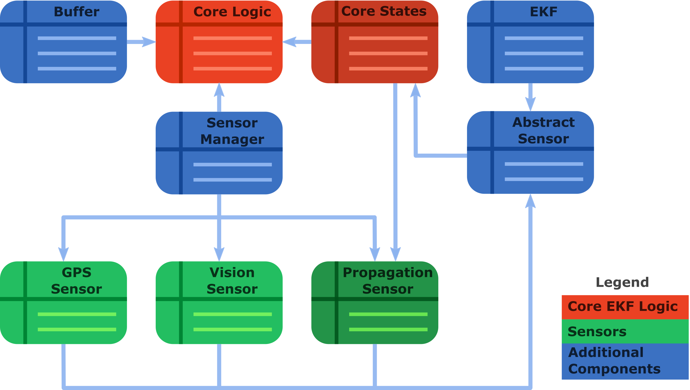
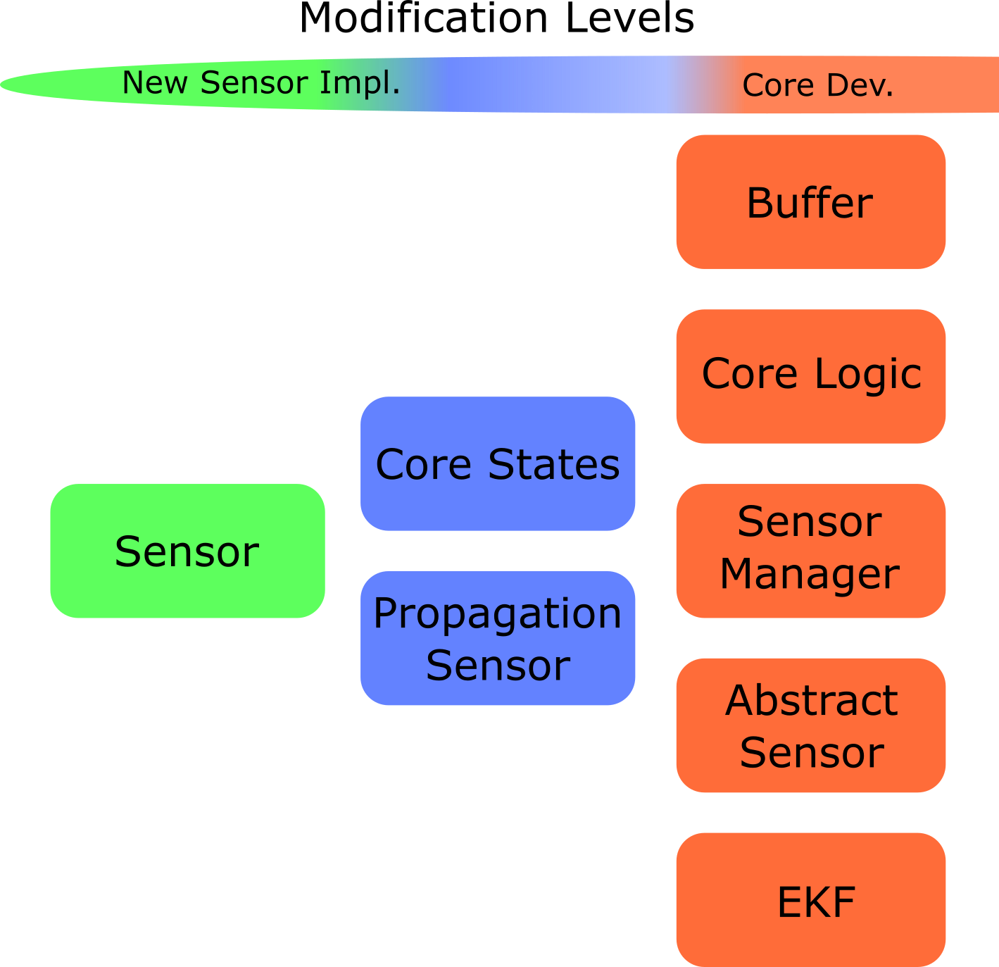
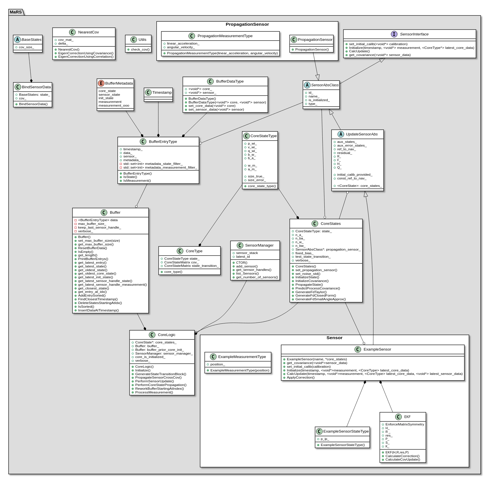
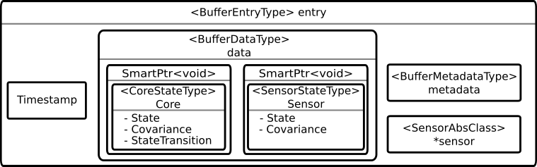
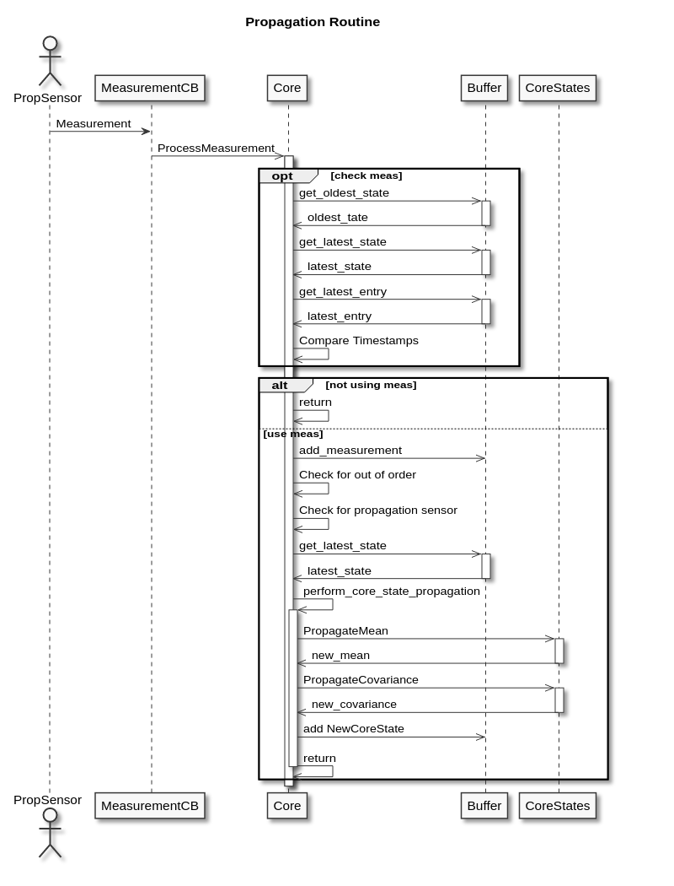
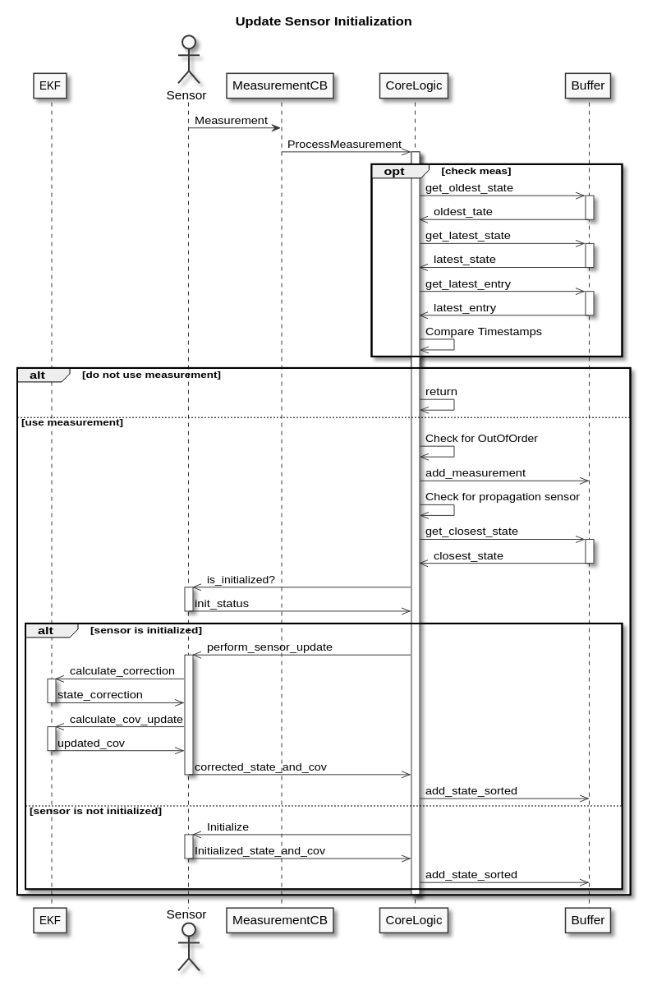
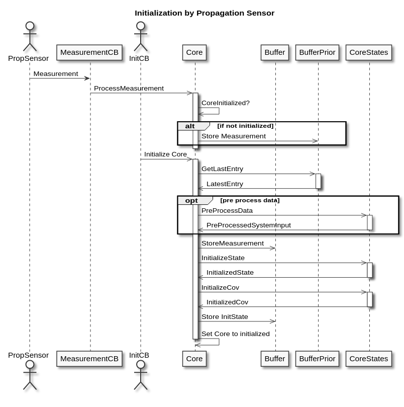

# Introduction

[](https://github.com/aau-cns/mars_lib/actions/workflows/cmake_release.yml) [](https://github.com/aau-cns/mars_lib/actions/workflows/cmake_debug.yml) [](https://doi.org/10.5281/zenodo.5185909) [](https://ieeexplore.ieee.org/document/9286578) [](./LICENSE)

The Modular and Robust State-Estimation Framework, or short, MaRS, is a recursive filtering framework that allows for truly modular multi-sensor integration. The framework further enables the handling of multiple sensors dynamically and performs self-calibration if auxiliary states are defined for the respective sensor module.

**Features:**

- Truly-Modular decoupling of Sensor-States from the essential Navigation-States
- Generalized covariance segmentation for Plug and Play state and covariance blocks
- Minimal State-Representation at any point in time
- Integration and removal of sensor modules during runtime
- Out of sequence sensor measurement handling
- Developed for computationally constrained platforms
- Efficient handling of asynchronous and multi-rate sensor information
- Separation between simple user interaction and the complexity of information handling

**Patents:**

- Austrian patent published [A 50969](https://patents.google.com/patent/AT523734B1/en)
- U.S. patent pending [US2022/0146264A1](https://patents.google.com/patent/US20220146264A1/en)

**Code Documentation:**

- You can find the Doxygen generated code documentation [here](https://aau-cns.github.io/mars_lib/)

**Whats New?**

- **Version 2.0.0:** Starting with this version, the MaRS buffer does not require a double entry for measurements and states anymore. A single buffer entry now tracks measurements and states. If no states are generated, e.g. because they are outliers, entries are kept in the buffer and their invalidity is indicated by a meta tag. This renders the buffer logic more lightweight and improves performance. Please refer to the [migration guide for API changes](#migration-100-to-200).

# Getting Started

## Setup and Building the Project

### Command-line setup

```sh
$ git clone <url> mars_cpp               # Get the code
$ cd mars_cpp && mkdir build && cd build # Setup the build dir
$ cmake -DCMAKE_BUILD_TYPE=Release ../   # Run cmake
$ make -j                                # Build the project
```

### QT-Creator setup

```sh
$ mkdir mars_ws && cd mars_ws # Setup the workspace
$ git clone <url> mars_cpp    # Get the code
$ cd mars_cpp    # Navigate to the code
$ qtcreator .    # Run QT-Creator and press 'Configure Project'
```

### Dependencies

MaRS has four dependencies which are automatically downloaded and linked against:

- Eigen
- yaml-cpp
- G-Test
- Boost

Thus, no dependencies need to be installed by hand.

## Code Documentation

You can find find the Doxygen generated code documentation, after the project was built, in:

```sh
mars_cpp/build/docs/api-docs/html/index.html
```

## Run tests

The MaRS framework has multiple options to perform tests on the code base, individual tests in classes, end-to-end tests with simulated data and isolated compilation for dependency checks.

### Google tests

The test suit `mars-test` performs tests on all classes and ensures that the member functions perform according to their definition. MaRS also provides two end-to-end tests, which are combined in the `mars-e2e-test` test suit. The two tests consist of an *IMU propagation only* scenario and an *IMU with pose update* scenario. The input for both test cases are synthetically generated datasets, and the end result of the test run is compared to the ground truth.

```sh
$ cd build                # Enter the build directory and run:
$ make test mars-test     # Tests for individual classes
$ make test mars-e2e-test # End to end tests with simulated data
```

### End to end test description

| Test Name                                        | Description                                                  |
| ------------------------------------------------ | ------------------------------------------------------------ |
| mars_e2e_imu_prop                                | IMU propagation only                                         |
| mars_e2e_imu_pose_update                         | IMU propagation and pose updates (IMU and pose updates are in synch) |

### Isolated Build and Tests with Docker

```sh
$ cd mars_cpp # Enter the source directory
$ docker build --network=host -t mars_test_env:latest . # Build the Docker image

# The following runs the container, maps the source code (read only)
# and executes the script in 'deploy/scripts/docker_application_test.sh'
$ docker run -it --rm \
  --network=host \
  -v "$(pwd)":/source:ro \
  mars_test_env:latest
```

# Programming

The code base is mostly C++ based and follows the C++ Google style convention. A C-Lang file with formating definitions / for auto formatting can be found in the root directory of the project `mars_lib/.clang-format`.

# The Framework

## Technology

MaRS uses covariance and state-vector segmentation to allow for a modular structure and the removal and integration of covariance blocks at a given point in time. This method, in particular, allows the removal of the state augmentation for one sensor modality, the processing of the essential navigation states in separation, and the consecutive augmentation of the navigation states as the particular measurements become available. The majority of previous frameworks would carry the state augmentation for each individual sensor at every processing step, which consumes additional computational power.

As an example: The image below, on the left side, shows the layout of a covariance matrix for a system with three main components. The components are the Navigation States (Core States), a sensor with calibration states (Sensor A), and a second sensor with calibration states (Sensor B). Previous frameworks would handle the full-sized covariance matrix throughout every filtering step which includes, the propagation of the core-states, updates of Sensor A or Sensor B, as well as repropagation in the case of delayed sensor measurements.

The right side of this diagram shows how MaRS is handling the same events. The navigation states are updated in isolation; in the event of a sensor measurement, the corresponding sensor information such as the state, sensor covariance, and cross-correlations with the core states are merged with the core state and updated. During this update step, it's important to notice that the covariance elements of the sensor have not been propagated while the core state has been propagated. The MaRS framework is correcting the individual covariance elements before the merging process.

The same holds for a multi-sensor system in which the update sequence is Sensor A -> Sensor-B -> Sensor-A. The update of Sensor-B would interfere with the straightforward covariance propagation because the covariance of the core state is updated, but the decupled and stored information on Sensor-A was not updated accordingly. MaRS uses Eigen-Value correction to correct for the missing information before updating Sensor-A in a consecutive step. Thus, the properties and coherence of the covariance matrices are guaranteed at all times.



For the full explanation of the technology, please refer to the MaRS Paper [**here**](https://ieeexplore.ieee.org/document/9286578), or watch this video animation on YouTube for an easier understanding of the covariance-segmentation process:

[](https://www.youtube.com/watch?v=6dLIDDi7bqk "Animation for MaRS: A Modular and Robust Sensor-Fusion Framework (RA-L 2020/08)")

### Assumptions

It is important to mention that MaRS makes one particular assumption for this method. As illustrated by the image on the covariance segments above, the Sensor-Core cross-covariances (purple elements) are handled correctly. However, the Sensor-Sensor cross-covariance (gray elements) is assumed to be zero and thus not stored throughout the process.

## Implementation / System Architecture

### System Layout

The MaRS framework is designed such that essential modules are interchangeable, and the definition of the core logic is agnostic to any sensor definition. For this, each component has generically defined interfaces. A simplified Pseudo UML diagram of the system elements is shown below.



This class structure is designed with simplified user-level interaction. This means that components that are likely to change or extended are simple to interact with, and more complex components are less likely the object to modification. The graph below shows the essential components and their complexity level. It's important to mention that changes or the addition of a sensor update module does not require modifications in any other component.



If you are interested in how the actual UML diagram for MaRS looks like, you can have a look at the image below or check out the Doxygen dependency graphs described [here](#Code-Documentation).



### The Buffer and its Data Structure

MaRS has a single buffer that holds all the information needed to operate the framework and to perform out-of-order updates. The data outline of a single buffer entry looks as follows:



Each buffer entry has a timestamp, a Core/Sensor data block, a metadata field for indicating the entry type (e.g., measurement, sensor update, core state), and a reference to the update sensor class instance for processing the Core/Sensor data field.

**Note:** When using the provided buffer API, the order of buffer entries is guaranteed to be chronological.

MaRS uses type erasure to allow the storage of different sensor types. Even though sensor modules are derived from the same abstract class, the overlaying structure can change for each sensor type. Thus MaRS casts the Core/Sensor data block to a shared void pointer. The referenced sensor module instance is then used to cast the individual type correctly.

Shared pointers are heavily used for this framework, especially for the storage of states and shared usage of the various modules of the framework. The buffer holds shared pointers to the state elements. These elements are referenced in the buffer and passed to sensor instances for processing. The smart pointers are passed to functions that use the move() function to generate a copy of the pointer. This is more efficient, and it makes clear that the particular object is a part-owner of this object.

On particular important feature of shared pointers are shared void pointers. If the last reference to this data element is deleted, then the shared pointer automatically calls the destructor of the void object. Normal pointers to void objects do not follow this behavior. If a normal void pointer goes out of scope, then the referenced data element remains allocated and causes a memory leak.

This property is important for the design of the framework because it makes use of type erasure and thus, stores references to objects as void pointers. Thus, states in the buffer that are removed because they exceed the defined maximal storage of the states in the buffer are destructed automatically.

### Measurement handling

All measurements are handled in the same fashion, which makes it simple for any middleware integration. As described in [this section](#Stand-Alone-Usage-and-Middleware-integration), a dedicated propagation sensor is defined on system start. Based on this, the system can distinguish between propagation and update sensors. To process any measurement, only the following line needs to be called:

```c++
// sensor_sptr: Pointer to the corresponding sensor instance
// timestamp: Measurement timestamp
// data: MaRS buffer data element
core_logic_.ProcessMeasurement(sensor_sptr, timestamp, data)
```

This is the content of any MaRS buffer entry and needs to be available on e.g., a callback triggered by a specific sensor. Within the `ProcessMeasurement(...)` function, MaRS divides the process for propagation and updates and performs the routines shown below. At this point, the framework also applies logic to determine if the measurement is still meaningful to the system (e.g., it could be out of order and too old) and processes out of order updates that are within limits accordingly (see [here](#Out-of-order-updates)).

#### State Propagation UML



#### Sensor Updates UML



#### Out of Order Updates

The handling of out-of-order updates within MaRS is straightforward. The general buffer history has one measurement followed by a state update entry. If an out-of-order measurement occurs, it's added to the buffer depending on its timestamp. All following state entries up to the current state are deleted (based on the metadata tag), and the measurements are feed to the `ProcessMeasurement(...)` function to generate the new state updates up to the current time.

#### Advanced Initialization

MaRS has a second buffer instance that can be used for advanced initialization. All sensor data for propagation or updates can be stored in this buffer and used in a pre-processing step before the actual initialization. By default, the framework uses the latest propagation sensor for initialization. The sequence of events is shown below:



### Default Navigation State

The Navigation-States (core states) are the essential states to localize a robot in the world, given the fact that these states are propagated with IMU measurements.

#### General Nomenclature

The translation $`{}_{A}\mathbf{P}_{BC}`$ defines frame $`C`$ with respect to frame $B$ expressed in frame $`A`$. The translation is expressed in frame $B$ if the subscript $`A`$ is not defined. The quaternion $`\mathbf{q}_{AB}`$ describes the rotation of frame $`B`$ with respect to frame $`A`$. $`\mathbf{R}_{(\mathbf{q}_{AB})}\equiv\mathbf{R}_{\mathbf{AB}}`$ denotes the conversion of quaternion $`\mathbf{q}_{AB}`$ to its corresponding rotation matrix. Please note that this framework uses the Hamilton notation for the Quaternion representation.

#### Symbols

| Symbol                                        | Description                                                  |
| --------------------------------------------- | ------------------------------------------------------------ |
| $`\mathbf{X}_{Core}`$                         | Navigation State                                             |
| $`\mathbf{p}_{WI}`$                           | Translation of the robot IMU/body frame expressed w.r.t. the world frame |
| $`\mathbf{v}_{WI}`$                           | Velocity of the robot IMU/body frame expressed w.r.t. the world frame |
| $`\mathbf{q}_{WI}`$                           | Orientation of the robot IMU/body frame expressed w.r.t. the world frame (Hamiltonian) |
| $`\mathbf{b}_{\omega}`$                       | Gyroscopic bias                                              |
| $`\mathbf{b}_{a}`$                            | Accelerometer bias                                           |
| $`\mathbf{n}_{\mathbf{\text{b}}_{\omega}}`$   | Zero mean white Gaussian noise of the gyroscope measurement  |
| $`\mathbf{n}_{\mathbf{\text{b}}_{a}}`$        | Zero mean white Gaussian noise of the accelerometer measurement |
| $`\boldsymbol{\Omega}(\omega)`$               | The right side Quaternion multiplication matrix for $\omega$ |

#### State-Definition

```math
\mathbf{X}_{Core} = \left[\mathbf{p}_{WI}^\mathsf{T},
\mathbf{v}_{WI}^\mathsf{T}, \mathbf{q}_{WI}^\mathsf{T}, \mathbf{b}_{\omega}^\mathsf{T}, \mathbf{b}_{a}^\mathsf{T} \right]^\mathsf{T}
```

<!--$$
\mathbf{X}_{Core}=\left[\text{\textbf{p}}_{WI}^\mathsf{T},
\text{\textbf{v}}_{WI}^\mathsf{T}, \text{\textbf{q}}_{WI}^\mathsf{T}, \text{\textbf{b}}_{\omega}^\mathsf{T}, \text{\textbf{b}}_{a}^\mathsf{T} \right]^\mathsf{T}
$$-->

<!--  -->

#### State-Dynamics

```math
\begin{align*}
   \dot{\mathbf{p}}_{WI} &= \mathbf{v}_{WI} \\
   \dot{\mathbf{v}}_{WI} &= \mathbf{R}_{\left(\mathbf{q}_{WI}\right)} (\mathbf{a}_m-\mathbf{b}_a-\mathbf{n}_a)-\mathbf{g} \\
   \dot{\mathbf{q}}_{WI} &= \frac{1}{2} \boldsymbol{\Omega}(\boldsymbol{\omega}_{m}-\mathbf{b}_w-\mathbf{n}_w) \mathbf{q}_{WI} \\
   \dot{\mathbf{b}}_{\omega} &= \mathbf{n}_{\mathbf{b}_{\omega}} ,\, \dot{\mathbf{b}}_{a} = \mathbf{n}_{\mathbf{b}_{a}}
\end{align*}
```

<!--$$
\begin{align}
\dot{\text{\textbf{p}}}_{WI} &= \text{\textbf{v}}_{WI} \\
\dot{\text{\textbf{v}}}_{WI} &= \mathbf{R}_{\left(\text{\textbf{q}}_{WI}\right)} (\mathbf{a}_m-\mathbf{b}_a-\mathbf{n}_a)-\mathbf{g} \\
\dot{\text{\textbf{q}}}_{WI} &= \frac{1}{2} \boldsymbol{\Omega}(\boldsymbol{\omega}_{m}-\mathbf{b}_w-\mathbf{n}_w) \text{\textbf{q}}_{WI} \\
\dot{\text{\textbf{b}}}_{\omega} &= \mathbf{n}_{\text{\textbf{b}}_{\omega}} ,\, \dot{\text{\textbf{b}}}_{a} = \mathbf{n}_{\text{\textbf{b}}_{a}}
\end{align}
$$-->

<!-- 

}(\mathbf{a}_m-\mathbf{b}_a-\mathbf{n}_a)-\mathbf{g})

\text{\textbf{q}}_{WI})

 -->

### Provided Sensor Modules (Plug and Play)

New sensor modules can be added in a simple and straightforward fashion. Please consult the [Tutorial](#Tutorials) section on how to use [existing sensor modules](#Sensor-Usage) and how to implement [new sensor modules](#Sensor-Implementation). Please find a list of pre-defined sensor modules below.

#### Position (3 DoF)

Symbols:

| Symbol                    | Definition                                                   |
| ------------------------- | ------------------------------------------------------------ |
| $`\mathbf{P}_{IP}`$       | Translation of the position sensor w.r.t. the robot IMU/body frame |

Measurement equation:

```math
z = \mathbf{P}_{WI} + \mathbf{R}_{WI} ~ \mathbf{P}_{IP}
```

<!-- $`z = \mathbf{P}_{WI} + \mathbf{R}_{WI} ~ \mathbf{P}_{IP}`$ -->
<!--$$
z = \text{\textbf{P}}_{WI} + \text{\textbf{R}}_{WI} ~ \text{\textbf{P}}_{IP}
$$-->
<!--  -->

#### Pose (6 DoF)

Symbols:

| Symbol                    | Definition                                                   |
| ------------------------- | ------------------------------------------------------------ |
| $`\mathbf{P}_{IP}`$       | Translation of the pose sensor w.r.t. the robot IMU/body frame |
| $`\mathbf{q}_{IP}`$       | Orientation of the pose sensors w.r.t. the robot IMU/body frame |

Measurement equation:

```math
\begin{align*}
   z_{p} &= \mathbf{P}_{WI} + \mathbf{R}_{WI} ~ \mathbf{P}_{IP} \\
   z_{q} &= \mathbf{q}_{WI} \otimes \mathbf{q}_{IP}
\end{align*}
```

<!-- $`z_{p} = \mathbf{P}_{WI} + \mathbf{R}_{WI} ~ \mathbf{P}_{IP}`$
$`z_{q} = \mathbf{q}_{WI} \otimes \mathbf{q}_{IP}`$ -->

<!--$$
\begin{align}
z_{p} =& \text{\textbf{P}}_{WI} + \text{\textbf{R}}_{WI} ~ \text{\textbf{P}}_{IP} \\
z_{q} =& \text{\textbf{q}}_{WI} \otimes \text{\textbf{q}}_{IP}
\end{align}
$$-->

<!--  -->
<!--  -->

#### Loosely-Coupled Vision (6 DoF)

Symbols:

| Symbol                    | Definition                                                   |
| ------------------------- | ------------------------------------------------------------ |
| $`\mathbf{P}_{VW}`$       | Translation of the vision world frame w.r.t. the world frame |
| $`\mathbf{R}_{VW}`$       | Orientation of the vision world frame w.r.t. the world frame |
| $`\mathbf{P}_{IC}`$       | Translation of the camera sensor w.r.t. the robot IMU/body frame |
| $`L`$                     | Vision scale                                                 |

Measurement equation:

```math
z = \left(\mathbf{P}_{VW} + \mathbf{R}_{VW}~\left(\mathbf{P}_{WI} + \mathbf{R}_{WI} ~ \mathbf{P}_{IC}\right)\right)~L
```

<!-- $`z = \left(\mathbf{P}_{VW} + \mathbf{R}_{VW}~\left(\mathbf{P}_{WI} + \mathbf{R}_{WI} ~ \mathbf{P}_{IC}\right)\right)~L`$ -->
<!--$$
z = \left(\text{\textbf{P}}_{VW} + \text{\textbf{R}}_{VW}~\left(\text{\textbf{P}}_{WI} + \text{\textbf{R}}_{WI} ~ \text{\textbf{P}}_{IC}\right)\right)~L
$$-->
<!-- \right)~L) -->

#### GNSS with local coordinate transforms (3 DoF)

Symbols:

| Symbol                    | Definition                                                   |
| ------------------------- | ------------------------------------------------------------ |
| $`\mathbf{P}_{GW~W}`$     | Translation of the GNSS world frame w.r.t. the world frame   |
| $`\mathbf{R}_{GW~W}`$     | Orientation of the GNSS world frame w.r.t. the world frame   |
| $`\mathbf{P}_{IG}`$       | Translation of the GNSS sensor w.r.t. the robot IMU/body frame |

Measurement equation:

```math
z = \mathbf{P}_{GW~W} + \mathbf{R}_{GW~W}~\left(\mathbf{P}_{WI} + \mathbf{R}_{WI} ~ \mathbf{P}_{IG}\right)
```

<!-- $`z = \mathbf{P}_{GW~W} + \mathbf{R}_{GW~W}~\left(\mathbf{P}_{WI} + \mathbf{R}_{WI} ~ \mathbf{P}_{IG}\right)`$ -->
<!--$$
z = \text{\textbf{P}}_{GW~W} + \text{\textbf{R}}_{GW~W}~\left(\text{\textbf{P}}_{WI} + \text{\textbf{R}}_{WI} ~ \text{\textbf{P}}_{IG}\right)
$$-->
<!-- ) -->

#### GNSS with rotational constraints from velocity

Symbols:

| Symbol                    | Definition                                                        |
| ------------------------- | ----------------------------------------------------------------- |
| $`\mathbf{R}_{WI}`$       | Rotation of the IMU/Body frame expressed w.r.t. the world frame   |
| $`\mathbf{V}_{WI}`$       | Velocity of the IMU/Body frame expressed w.r.t. the world frame   |
| $`\mathbf{P}_{IG}`$       | Translation of the GNSS sensor w.r.t. the robot IMU/body frame    |
| $`\omega_{I}`$            | Angular velocity of the IMU/Body frame                            |


```math
\mathbf{Z} = \mathbf{V}_{WG} = \mathbf{R}_{WI}\alpha\left\|\mu\right\|, \\
```

<!-- $`\mathbf{Z} = \mathbf{V}_{WG} = \mathbf{R}_{WI}\alpha\left\|\mu\right\|`$ -->
<!--  -->

with

```math
\alpha=\begin{bmatrix} 1 \\ 0 \\ 0 \end{bmatrix}
```

<!-- $`\alpha=\begin{bmatrix} 1 \\ 0 \\ 0 \end{bmatrix}`$ -->
<!--  -->

for alignment with the x-axis, and

```math
\mu=\mathbf{V}_{WI}+\mathbf{R}_{WI} [\omega_i]_{\times} \mathbf{P}_{IG}.
```

<!-- $`\mu=\mathbf{V}_{WI}+\mathbf{R}_{WI} [\omega_i]_{\times} \mathbf{P}_{IG}`$. -->
<!--  -->

Thus

```math
\mathbf{V}_{WG}=\mathbf{R}_{WI}\begin{bmatrix} 1 & 0 & 0 \end{bmatrix}^\mathsf{T} \left\|\mathbf{V}_{WI}+\mathbf{R}_{WI}[\omega_i]_{\times} \mathbf{P}_{IG}\right\|.
```

<!-- $`\mathbf{V}_{WG}=\mathbf{R}_{WI}\begin{bmatrix} 1 & 0 & 0 \end{bmatrix}^\mathsf{T} \left\|\mathbf{V}_{WI}+\mathbf{R}_{WI}[\omega_i]_{\times} \mathbf{P}_{IG}\right\|`$. -->
<!--  -->

Leading to the following derivatives

```math
\begin{align*}
   \frac{\mathrm{d}h(x)}{\mathrm{d}\delta_{rm}} &= -\mathbf{R}_{WI}\left[\alpha\right]_{\times} \left\|\mu\right\|-\mathbf{R}_{WI}\alpha\frac{\mu^\mathsf{T}}{\left\|\mu\right\|}\mathbf{R}_{WI}\left[\left[\omega_i\right]_{\times} \mathbf{P}_{IG}\right]_{\times} \\
   \frac{\mathrm{d}h(x)}{\mathrm{d}\Delta\mathbf{V}}_{WI} &= \mathbf{R}_{WI}\alpha\frac{\mu^\mathsf{T}}{\left\|\mu\right\|} \\
   \frac{\mathrm{d}h(x)}{\mathrm{d}\Delta\mathbf{P}}_{IG} &= \mathbf{R}_{WI}\alpha\frac{\mu^\mathsf{T}}{\left\|\mu\right\|}\mathbf{R}_{WI}\left[\omega_i\right]_{\times}
\end{align*}
```


<!-- $`\frac{\mathrm{d}h(x)}{\mathrm{d}\delta_{rm}}=-\mathbf{R}_{WI}[\alpha]\left\|\mu\right\|-\mathbf{R}_{WI}\alpha\frac{\mu^\mathsf{T}}{\left\|\mu\right\|}\mathbf{R}_{WI}\left[\left[\omega_i\right]_{\times} \mathbf{P}_{IG}\right]_{\times}`$,

$`\frac{\mathrm{d}h(x)}{\mathrm{d}\Delta\mathbf{V}}_{WI} = \mathbf{R}_{WI}\alpha\frac{\mu^\mathsf{T}}{\left\|\mu\right\|}`$

$`\frac{\mathrm{d}h(x)}{\mathrm{d}\Delta\mathbf{P}}_{IG} = \mathbf{R}_{WI}\alpha\frac{\mu^\mathsf{T}}{\left\|\mu\right\|}\mathbf{R}_{WI}\left[\omega_i\right]_{\times}`$ -->

<!-- }{\mathrm{d}\delta_{rm}}=-\textrm{\textbf{R}}_{WI}[\alpha]\left\|\mu\right\|-\textrm{\textbf{R}}_{WI}\alpha\frac{\mu^T}{\left\|\mu\right\|}\textrm{\textbf{R}}_{WI}\left[\left[\omega_i\right]\textrm{\textbf{P}}_{IG}\right])

}{\mathrm{d}\Delta\textrm{\textbf{V}}_{WI}}=\textrm{\textbf{R}}_{WI}\alpha\frac{\mu^T}{\left\|\mu\right\|})

}{\mathrm{d}\Delta\textrm{\textbf{P}}_{IG}}=\textrm{\textbf{R}}_{WI}\alpha\frac{\mu^T}{\left\|\mu\right\|}\textrm{\textbf{R}}_{WI}\left[\omega_i\right]) -->

#### Magnetometer (3 DoF)

Symbols:


| Symbol                    | Definition                                                        |
| ------------------------- | ----------------------------------------------------------------- |
| $`\mathbf{R}_{IM}`$       | Orientation of the Magnetometer w.r.t. the robot IMU/body frame   |
| $`{}_W\text{\textbf{mag}}`$ | Magnetic field vector expressed in the world frame                |

Measurement equation:

```math
z = \mathbf{R}_{IM}^\mathsf{T} ~ \mathbf{R}_{WI}^\mathsf{T} ~ {}_W\text{\textbf{mag}}
```

<!-- $`z = \mathbf{R}_{IM}^\mathsf{T} ~ \mathbf{R}_{WI}^\mathsf{T} ~ {}_W\text{\textbf{mag}}`$ -->
<!--$$
z = \text{\textbf{R}}_{IM}^\mathsf{T} ~ \text{\textbf{R}}_{WI}^\mathsf{T} ~ {}_W\text{\textbf{mag}}
$$-->
<!--  -->

#### Barometric Pressure (1 DoF)

Symbols:


| Symbol                    | Definition                                                        |
| ------------------------- | ----------------------------------------------------------------- |
| $`\mathbf{P}_{IP}`$       | Translation of the pressure sensor w.r.t. the robot IMU/body frame |

Measurement equation:

```math
z = \begin{bmatrix} 0 & 0 & 1 \end{bmatrix} \left(\mathbf{P}_{WI} + \mathbf{R}_{WI} ~ \mathbf{P}_{IP} \right)
```

<!-- $`z = \begin{bmatrix} 0 & 0 & 1 \end{bmatrix} \left(\mathbf{P}_{WI} + \mathbf{R}_{WI} ~ \mathbf{P}_{IP} \right)`$ -->
<!--$$
z = \begin{bmatrix} 0 \\ 0 \\ 1 \end{bmatrix}^\mathsf{T} \left(\text{\textbf{P}}_{WI} + \text{\textbf{R}}_{WI} ~ \text{\textbf{P}}_{IP} \right)
$$-->
<!-- ) -->

#### Body Velocity (3 DoF)

Symbols:


| Symbol                    | Definition                                                        |
| ------------------------- | ----------------------------------------------------------------- |
| $`\mathbf{P}_{IB}`$       | Translation of the bodyvel sensor w.r.t. the robot IMU/body frame |
| $`\mathbf{R}_{IB}`$       | Orientation of the bodyvel sensor w.r.t. the robot IMU/body frame |
| $`\omega_{I}`$            | Angular velocity of the IMU/Body frame                            |

Measurement equation:

```math
z = \mathbf{R}_{IB}^\mathsf{T} \mathbf{R}_{WI}^\mathsf{T} \mathbf{V}_{WI} + \mathbf{R}_{IB}^\mathsf{T} \left[\omega_{I}\right]_{\times} \mathbf{P}_{IB}
```

<!-- $`z = \mathbf{R}_{IB}^\mathsf{T} \mathbf{R}_{WI}^\mathsf{T} \mathbf{V}_{WI} + \mathbf{R}_{IB}^\mathsf{T} \left[\omega_{I}\right]_{\times} \mathbf{P}_{IB}`$ -->
<!--$$
z = \text{\textbf{R}}_{IB}^\mathsf{T} \text{\textbf{R}}_{WI}^\mathsf{T} \text{\textbf{V}}_{WI} + \text{\textbf{R}}_{IB}^\mathsf{T} \omega_{I} \times \text{\textbf{P}}_{IB}
$$-->
<!--  -->


#### Attitude (2-3 DoF)

Symbols:


| Symbol                    | Definition                                                        |
| ------------------------- | ----------------------------------------------------------------- |
| $`\mathbf{q}_{AW}`$       | Orientation of the attitude origin w.r.t. the world/global frame  |
| $`\mathbf{q}_{IB}`$       | Orientation of the attitude sensor w.r.t. the robot IMU/body frame |

Measurement equation:

```math
z = \mathbf{R}_{AW}\mathbf{R}_{WI}\mathbf{R}_{IB}
```

<!-- $`z = \mathbf{R}_{AW}\mathbf{R}_{WI}\mathbf{R}_{IB}`$ -->
<!--$$
z = \text{\textbf{R}}_{AW}\text{\textbf{R}}_{WI}\text{\textbf{R}}_{IB}
$$-->
<!--  -->


## CSV file formats for sensor data

Individual symbols are described in section [Symbols](#Symbols) and sensor states are described in section [Provided Sensor Modules (Plug and Play)](#provided-sensor-modules-plug-and-play)

### Input Files

| Sensor                                                       | CSV File Column Entries                   |
| ------------------------------------------------------------ | ----------------------------------------- |
| IMU                                                          | [time, a_x, a_y, a_z, w_x, w_y, w_z]      |
| [Position Sensor](#position-3-dof)                           | [time, p_x, p_y, p_z]                     |
| [Pose Sensor](#pose-6-dof)                                   | [time, p_x, p_y, p_z, q_w, q_x, q_y, q_z] |
| [Vision Sensor](#loosely-coupled-vision-6-dof)               | [time, p_x, p_y, p_z, q_w, q_x, q_y, q_z] |
| [GNSS](#gnss-with-local-coordinate-transforms-3-dof)         | [time, lat, long, alt]                    |
| [GNSS with Velocity](#gnss-with-rotational-constraints-from-velocity) | [time, lat, long, alt, v_x, v_y, v_z]     |
| [Magnetometer](#magnetometer-3-dof)                          | [time, m_x, m_y, m_z]                     |
| [Pressure Sensor](#barometric-pressure-1-dof)                | [time, pressure]                          |

### Output Files

| Sensor                                                       | CSV File Column Entries                                      |
| ------------------------------------------------------------ | ------------------------------------------------------------ |
| [Core States](#state-definition)                             | [time, w_x, w_y, w_z, a_x, a_y, a_z, p_wi_x, p_wi_y, p_wi_z, v_x, v_y, v_z,<br />q_wi_w, q_wi_x, q_wi_y, q_wi_z, bw_x, bw_y, bw_z, ba_x, ba_y, ba_z] |
| [Position Sensor](#position-3-dof)                           | [time, p_ip_x, p_ip_y, p_ip_z]                               |
| [Pose Sensor](#pose-6-dof)                                   | [time, p_ip_x, p_ip_y, p_ip_z, q_ip_w, q_ip_x, q_ip_y, q_ip_z] |
| [Vision Sensor](#loosely-coupled-vision-6-dof)               | [time, p_ip_x, p_ip_y, p_ip_z, q_ip_w, q_ip_x, q_ip_y, q_ip_z] |
| [GNSS](#gnss-with-local-coordinate-transforms-3-dof)         | [time, p_ig_x, p_ig_y, p_ig_z, p_gw_w_x, p_gw_w_y, p_gw_w_z, <br />q_gw_w_w, q_gw_w_x, q_gw_w_y, q_gw_w_z] |
| [GNSS with Velocity](#gnss-with-rotational-constraints-from-velocity) | [time, p_ig_x, p_ig_y, p_ig_z, p_gw_w_x, p_gw_w_y, p_gw_w_z, <br />q_gw_w_w, q_gw_w_x, q_gw_w_y, q_gw_w_z] |
| [Magnetometer](#magnetometer-3-dof)                          | [time, mag_w_x, mag_w_y, mag_w_z, q_im_w, q_im_x, q_im_y, q_im_z] |
| [Pressure Sensor](#barometric-pressure-1-dof)                | [time, p_ip_x, p_ip_y, p_ip_z, bias]                               |


## Package Layout/Codebase

Generated with `tree -a -L 3 --noreport --charset unicode > layout.md`

```
├── CMakeLists.txt
├── include
│   └── mars
│       ├── buffer.h
│       ├── core_logic.h
│       ├── core_state.h
│       ├── data_utils
│       │   ├── read_csv.h
│       │   ├── read_pose_data.h
│       │   └── read_sim_data.h
│       ├── ekf.h
│       ├── general_functions
│       │   └── utils.h
│       ├── mars_api.h
│       ├── mars_export.h
│       ├── mars_features.h
│       ├── nearest_cov.h
│       ├── sensor_manager.h
│       ├── sensors
│       │   ├── bind_sensor_data.h
│       │   ├── imu
│       │   │   ├── imu_measurement_type.h
│       │   │   └── imu_sensor_class.h
│       │   ├── pose
│       │   │   ├── pose_measurement_type.cpp
│       │   │   ├── pose_measurement_type.h
│       │   │   ├── pose_sensor_class.cpp
│       │   │   ├── pose_sensor_class.h
│       │   │   ├── pose_sensor_state_type.cpp
│       │   │   └── pose_sensor_state_type.h
│       │   ├── position
│       │   │   └── ...
│       │   ├── sensor_abs_class.h
│       │   ├── sensor_interface.h
│       │   └── update_sensor_abs_class.h
│       ├── TBuffer.h
│       ├── time.h
│       ├── timestamp.h
│       └── type_definitions
│           ├── base_states.h
│           ├── buffer_data_type.h
│           ├── buffer_entry_type.h
│           ├── core_state_type.h
│           └── core_type.h
├── include_local
│   └── mars
│       ├── helper.hpp
│       └── utils.hpp
└── source
    ├── buffer.cpp
    ├── buffer_entry_type.cpp
    ├── core_logic.cpp
    ├── core_state_calc_q.cpp
    ├── core_state.cpp
    ├── ekf.cpp
    ├── nearest_cov.cpp
    ├── sensor_abs_class.cpp
    ├── sensor_interface.cpp
    ├── sensor_manager.cpp
    ├── time.cpp
    ├── timestamp.cpp
    └── utils.cpp
```

# Tutorials

This section explains the interaction with the essential components of the MaRS Framework and how to customize components to different state-estimation modularities.

## Stand-Alone Usage and Middleware integration

Due to the usage of the MaRS C++ API, the direct use of the MaRS library or using the library within any middleware framework is possible with no significant overhead.

The only difference between the two scenarios is the method in which the data is passed to the framework. To use MaRS without any middleware, you can have a look at one of the end2end tests that MaRS provides and define your own executable in the same fashion. You can use the outline of `source/test/mars-e2e-test/mars_e2e_imu_pose_update.cpp` as a reference. MaRS already provides methods to read data from a CSV file and store results after processing.

For the implementation of a MaRS wrapper, you can use this project as a reference: [MaRS ROS](https://github.com/aau-cns/mars_ros). The sections below make use of code snippets from the MaRS ROS wrapper.

### Essential Component Instantiation

MaRS needs a few persistent component instantiations to operate. The instantiation and association of these components are shown below.

#### The code

```c++
#include <mars/core_logic.h>
#include <mars/core_state.h>
#include <mars/sensors/imu/imu_measurement_type.h>
#include <mars/sensors/imu/imu_sensor_class.h>
#include <mars/sensors/pose/pose_measurement_type.h>
#include <mars/type_definitions/buffer_data_type.h>
#include <mars/type_definitions/buffer_entry_type.h>
#include <mars_msg_conv.h>
#include <sensor_msgs/Imu.h>
#include <Eigen/Dense>

// Setup Framework Components
imu_sensor_sptr_ = std::make_shared<mars::ImuSensorClass>("IMU");
core_states_sptr_ = std::make_shared<mars::CoreState>();
core_states_sptr_.get()->set_propagation_sensor(imu_sensor_sptr_);
core_logic_ = mars::CoreLogic(core_states_sptr_);
core_logic_.buffer_.set_max_buffer_size(800);

core_states_sptr_->set_noise_std(
    Eigen::Vector3d(0.013, 0.013, 0.013), Eigen::Vector3d(0.0013, 0.0013, 0.0013),
    Eigen::Vector3d(0.083, 0.083, 0.083), Eigen::Vector3d(0.0083, 0.0083, 0.0083));

// Sensor Definition
pose1_sensor_sptr_ = std::make_shared<mars::PoseSensorClass>("Pose1", core_states_sptr_);
Eigen::Matrix<double, 6, 1> pose_meas_std;
pose_meas_std << 0.05, 0.05, 0.05, 3 * (M_PI / 180), 3 * (M_PI / 180), 3 * (M_PI / 180);
pose1_sensor_sptr_->R_ = pose_meas_std.cwiseProduct(pose_meas_std);

// Sensor Calibration
PoseSensorData pose_calibration;
pose_calibration.state_.p_ip_ = Eigen::Vector3d(0.0, 0.0, 0.0);
pose_calibration.state_.q_ip_ = Eigen::Quaterniond::Identity();
Eigen::Matrix<double, 6, 6> pose_cov;
pose_cov.setZero();
pose_cov.diagonal() << 0.0025, 0.0025, 0.0025, 0.0076, 0.0076, 0.0076;  // 5cm, 5deg
pose_calibration.sensor_cov_ = pose_cov;
pose1_sensor_sptr_->set_initial_calib(std::make_shared<PoseSensorData>(pose_calibration));

// Sensor Chi2`
pose1_sensor_sptr_->chi2_.set_chi_value(0.05);
pose1_sensor_sptr_->chi2_.ActivateTest(true);
```

#### The code explained

```c++
imu_sensor_sptr_ = std::make_shared<mars::ImuSensorClass>("IMU");
```

This line initialized the IMU sensor instance. Each sensor class can be given a name that is used in logs and warnings for clarity.

```c++
core_states_sptr_ = std::make_shared<mars::CoreState>();
```

This line creates the core states. Core states are only instantiated once and are used to provide methods on how to operate on the core state throughout the framework.

```c++
core_states_sptr_.get()->set_propagation_sensor(imu_sensor_sptr_);
```

At this point, the connection between the core states and the propagation sensor is made. This is used for e.g., the definition on how an incoming measurement is handled, and the information for the propagation process is routed accordingly.

```c++
// Sensors
pose1_sensor_sptr_ = std::make_shared<mars::PoseSensorClass>("Pose1", core_states_sptr_);
Eigen::Matrix<double, 6, 1> pose_meas_std;
pose_meas_std << 0.05, 0.05, 0.05, 3 * (M_PI / 180), 3 * (M_PI / 180), 3 * (M_PI / 180);
pose1_sensor_sptr_->R_ = pose_meas_std.cwiseProduct(pose_meas_std);
```

These lines initialize a single sensor. First, similar to the IMU sensor instantiation, a shared pointer to the specific sensor object is created. Update sensors, compared to the propagation sensor, require the knowledge of the core state design. Thus, the shared pointer to the common core object needs to be provided for the sensor instantiation. Second, each sensor has a measurement noise field that depends on the state definition. Here, the values for the measurement noise are stored in `pose1_sensor_sptr_->R_`.

```c++
// Sensor Calibration
PoseSensorData pose_calibration;
pose_calibration.state_.p_ip_ = Eigen::Vector3d(0.0, 0.0, 0.0);
pose_calibration.state_.q_ip_ = Eigen::Quaterniond::Identity();
Eigen::Matrix<double, 6, 6> pose_cov;
pose_cov.setZero();
pose_cov.diagonal() << 0.0025, 0.0025, 0.0025, 0.0076, 0.0076, 0.0076;  // 5cm, 5deg
pose_calibration.sensor_cov_ = pose_cov;
pose1_sensor_sptr_->set_initial_calib(std::make_shared<PoseSensorData>(pose_calibration));
```

Each sensor, given that it has calibration states, has the option to initialize this calibration. Depending on the sensor module definition, the calibration states are automatically calibrated if `sensor->set_initial_calib( ..)` was not called.

The first lines instantiate a sensor state object that is set in consecutive lines. The second part of these lines generates the covariance matrix and map it to the state object. In the last line, the state object is passed to the sensor instance to set the calibration parameter.

```c++
// Sensor Chi2`
pose1_sensor_sptr_->chi2_.set_chi_value(0.05);
pose1_sensor_sptr_->chi2_.ActivateTest(true);
```

Finally, a Chi2 test can be activated per sensor to perform a measurement validation and possible rejection at the update stage. These two options set the confidence value of the check and activate it. The Chi2-rejection test is deactivated by default.

### Navigation State Propagation

The routine for the propagation of the navigation states through propagation sensor measurements is generally not different from the sensor update routine. However, this routine includes the initialization of the filter and is thus shown for completeness.

#### The code

```c++
void MarsWrapperPose::ImuMeasurementCallback(const sensor_msgs::ImuConstPtr& meas)
{
  // Map the measutement to the mars type
  Time timestamp(meas->header.stamp.toSec());

  // Generate a measurement data block
  BufferDataType data;
  data.set_sensor_data(std::make_shared<IMUMeasurementType>
                       (MarsMsgConv::ImuMsgToImuMeas(*meas)));

  // Call process measurement
  core_logic_.ProcessMeasurement(imu_sensor_sptr_, timestamp, data);

  // Initialize the first time at which the propagation sensor occures
  if (!core_logic_.core_is_initialized_)
  {
    core_logic_.Initialize(p_wi_init_, q_wi_init_);
  }

  if (publish_on_propagation_)
  {
     mars::BufferEntryType latest_state;
     core_logic_.buffer_.get_latest_state(&latest_state);

     mars::CoreStateType latest_core_state = static_cast<mars::CoreType*>
         (latest_state.data_.core_.get())->state_;

     pub_ext_core_state_.publish(MarsMsgConv::ExtCoreStateToMsg(
          latest_state.timestamp_.get_seconds(), latest_core_state));
  }
}
```

#### The code explained

```c++
// Map the measutement to the mars type
Time timestamp(meas->header.stamp.toSec());

// Generate a measurement data block
BufferDataType data;
data.set_sensor_data(std::make_shared<IMUMeasurementType>
                     (MarsMsgConv::ImuMsgToImuMeas(*meas)));
```

In the first lines, the data types which may be specific to the middleware are mapped to internal MaRS types. This concerns the timestamp type and sensor measurement. For the ROS wrapper, the MaRS framework already provides conversions between ROS messages and various sensor measurement types. These are then mapped to the buffer data field.

```c++
// Call process measurement
core_logic_.ProcessMeasurement(imu_sensor_sptr_, timestamp, data);
```

In the next step, this information is passed to the `ProcessMeasurement` routine. This routine requires the shared pointer to the individual sensor instance, the timestamp associated with the measurement, and the measurement in the form of a buffer element data type.

```c++
// Initialize the first time at which the propagation sensor occures
if (!core_logic_.core_is_initialized_)
{
  core_logic_.Initialize(p_wi_init_, q_wi_init_);
}
```

The `ProcessMeasurement` routine does not start the filtering process until the `Initialize()` member function is called. This function can be altered, but in the default case, it uses the latest pose information for the initialization.

```c++
mars::BufferEntryType latest_state;
core_logic_.buffer_.get_latest_state(&latest_state);

mars::CoreStateType latest_core_state = static_cast<mars::CoreType*>
     (latest_state.data_.core_.get())->state_;
```

The last segments cover the call for the latest data entries and their consecutive publishing. After calling the `ProcessMeasurement()` function, the buffer is up to date, and the latest entry contains the latest state. First, we instantiate a variable of the buffer entry type, which will receive the latest state in the next step with `get_latest_state()`. After this, we get the "state" element from the data field of the buffer. Since this is a void type, we need to cast it to the CoreType before usage. The buffer entry data type is described [here](#The-Buffer-and-its-Data-Structure)

```c++
pub_ext_core_state_.publish(MarsMsgConv::ExtCoreStateToMsg(
     latest_state.timestamp_.get_seconds(), latest_core_state));
```

In the final step, we convert the state information to a ROS message and publish it accordingly.

### Sensor Updates

#### The code

```c++
void MarsWrapperPose::PoseMeasurementUpdate(
std::shared_ptr<mars::PoseSensorClass> sensor_sptr,
const PoseMeasurementType& pose_meas, const Time& timestamp)
{
  // TMP feedback init pose
  p_wi_init_ = pose_meas.position_;
  q_wi_init_ = pose_meas.orientation_;

  // Generate a measurement data block
  BufferDataType data;
  data.set_sensor_data(std::make_shared<PoseMeasurementType>(pose_meas));

  // Call process measurement
  if (!core_logic_.ProcessMeasurement(sensor_sptr, timestamp_corr, data))
  {
    return;
  }

  // Publish the latest sensor state
  mars::BufferEntryType latest_result;
  core_logic_.buffer_.get_latest_sensor_handle_state(
     sensor_sptr, &latest_result);

  mars::CoreStateType latest_core_state = static_cast<mars::CoreType*>
     (latest_state.data_.core_.get())->state_;
  pub_ext_core_state_.publish(MarsMsgConv::ExtCoreStateToMsg(
     latest_state.timestamp_.get_seconds(), latest_core_state));

  mars::PoseSensorStateType pose_sensor_state =
     sensor_sptr.get()->get_state(latest_result.data_.sensor_);
  pub_pose1_state_.publish(MarsMsgConv::PoseStateToPoseMsg(
     latest_result.timestamp_.get_seconds(), pose_sensor_state));
}
```

#### The code explained

```c++
// TMP feedback init pose
p_wi_init_ = pose_meas.position_;
q_wi_init_ = pose_meas.orientation_;
```

These lines depend on the specific usage of the filter, but in general, you need information on how to initialize the filter. In this case, we store the latest pose of a pose sensor and pass this to the core state initialization routine of the filter should be initialized.

```c++
// Generate a measurement data block
BufferDataType data;
data.set_sensor_data(std::make_shared<PoseMeasurementType>(pose_meas));
```

At this point, we are simply mapping the sensor measurement, which is already provided as the sensor's measurement type.

```c++
// Call process measurement
if (!core_logic_.ProcessMeasurement(sensor_sptr, timestamp_corr, data))
{
  return;
}
```

Similar to the propagation routine, we pass the shared pointer to the specific sensor instance, the time stamp, and sensor measurement to the `ProcessMeasurement` function. The function returns true if the update was successful.

```c++
// Publish the latest sensor state
mars::BufferEntryType latest_result;
core_logic_.buffer_.get_latest_sensor_handle_state(
   sensor_sptr, &latest_result);
```

At this point, we get the latest core state and state of the sensor (if this sensor has calibration states defined). First, we generate a buffer entry, then `get_latest_sensor_handle_state` returns the latest state which was generated by the sensor, associated with the shared pointer `sensor_sptr`.

```c++
mars::CoreStateType latest_core_state = static_cast<mars::CoreType*>
   (latest_state.data_.core_.get())->state_;
pub_ext_core_state_.publish(MarsMsgConv::ExtCoreStateToMsg(
   latest_state.timestamp_.get_seconds(), latest_core_state));
```

Here we use the buffer entry from the previous step and extract the core state information, which is part of the buffer entry data field. The core state MaRS data type is then converted to a ROS message and published.

```c++
mars::PoseSensorStateType pose_sensor_state =
   sensor_sptr.get()->get_state(latest_result.data_.sensor_);
pub_pose1_state_.publish(MarsMsgConv::PoseStateToPoseMsg(
   latest_result.timestamp_.get_seconds(), pose_sensor_state));
```

These lines act in the same way as for the core state publishing described above. The only difference is that we are accessing the buffer data sensor field and convert the MaRS sensor data type to another ROS message type. Also, instead of casting the type by hand, the sensor class already provides a getter function to perform the case.

## Implementation of new Sensor Models

The definition of a sensor requires three essential files. These files should be placed in a dedicated folder.

Files to copy/generate in `source/mars/include/mars/sensors/<your_sensor>`:

- <your_sensor>_measurement_type.h
- <your_sensor>_sensor_state_type.h
- <your_sensor>_sensor_class.h

You can copy the files from the pose sensor module and use them as a template.

**Steps:**

1. Define the data type for your sensor measurements in `<your_sensor>_measurement_type.h`
2. Define the sensor state in `<your_sensor>_sensor_state_type.h`
3. In `<your_sensor>_sensor_class.h`:
   1. Edit the data types to the definition from the two files above
   2. Edit the initialization routine
   3. Edit the measurement mapping
   4. Edit the definition of the Jacobian
   5. Edit the definition of the residual
   6. Edit the definition of the `ApplyCorrection(...)` member function

**Add the files to the CMakelist:**

CMakeLists in `source/mars/CMakeLists.txt`Add the sensor-files to:

```cmake
set(headers
    ...
    ${include_path}/sensors/<your_sensor>/<your_sensor>_measurement_type.h
    ${include_path}/sensors/<your_sensor>/<your_sensor>_sensor_class.h
    ${include_path}/sensors/<your_sensor>/<your_sensor>_sensor_state_type.h
    ...
    )
```

If your sensor requires helper classes or have `.cpp` files, you need to add them to the following section:

```cmake
set(sources
    ...
    ${include_path}/sensors/<your_sensor>
    ...
    )
```

After these steps have been completed, you can use the sensor as a generalized object in the MaRS framework.

# Demonstrations

## Closed-Loop Modular Position Estimation

**Setup:**

- Ublox GPS Receiver (8Hz)
- Pixhawk Autopilot IMU (200Hz)
- MaRS GNSS Pose-Estimation
- PX4 State-Estimation Bridge
  - Clean and direct interface to our MARS estimator without chained EKF structures (e.g., via build-in PX4 EKF2)
  - Link to the complete flight setup: [AAU CNS Flight Package](TODO)

[](https://www.youtube.com/watch?v=sVYeHpfOjuQ "Dual-GNSS Localization using the MaRS Framework")

# Migration Guide

## Migration 1.0.0 to 2.0.0

- Member of `mars::BufferEntryType` `IsState()` -> `HasStates()`
- Member of `BufferDataType` within  `mars::BufferEntryType`
  -  `buffer_entry.data_.core_`->`buffer_entry.data_.core_state_`
  -  `buffer_entry.data_.sensor_`->`buffer_entry.data_.sensor_state_`
  - Measurement data is not indicated by meta data anymore and now has a dedicated member variable and setter: `data.set_sensor_data()`->`data.set_measurement()`
- `BufferMetadataType` has no type calles `measurement` anymore. It now indicates the validity of the state and remarks if a measurement was out of order. Passing this type can now be omitted e.g.: `BufferEntryType gps_meas_entry(timestamp, data, gps1_sensor_sptr_, BufferMetadataType::measurement);`-> `BufferEntryType gps_meas_entry(timestamp, data, gps1_sensor_sptr_);`

# Known Issues

- Process Noise: At the very moment, MaRS only supports the definition of dynamic process noise for the core states and not for sensor auxiliary/calibration states.

# Contact

For further information, please contact [Christian Brommer](mailto:christian.brommer@aau.at)

# License

This software is made available to the public to use (_source-available_), licensed under the terms of the BSD-2-Clause-License with no commercial use allowed, the full terms of which are made available in the [LICENSE](./LICENSE) file. No license in patents is granted.

## Usage for academic purposes

If you use this software in an academic research setting, please cite the corresponding paper and consult the [LICENSE](./LICENSE) file for a detailed explanation.

```latex
@inproceedings{brommer2020,
   author   = {Brommer, Christian and Jung, Roland and Steinbrener, Jan and Weiss, Stephan},
   doi      = {10.1109/LRA.2020.3043195},
   journal  = {IEEE Robotics and Automation Letters},
   title    = {{MaRS : A Modular and Robust Sensor-Fusion Framework}},
   year     = {2020}
}
```
