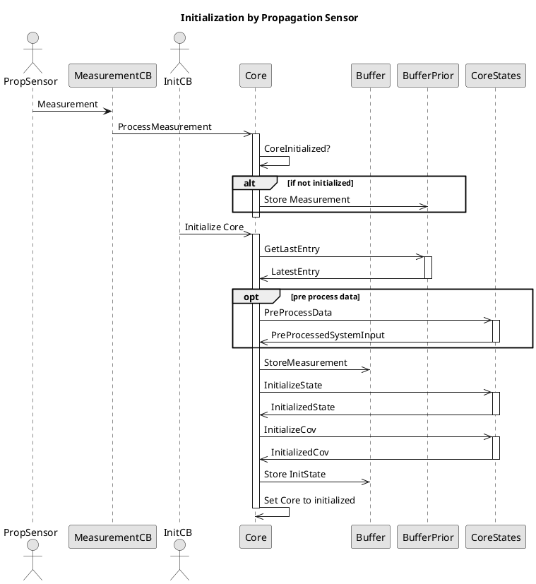

```plantuml
@startuml

skinparam monochrome true
title Initialization by Propagation Sensor

actor PropSensor
participant MeasurementCB
actor InitCB
participant Core
participant Buffer
participant BufferPrior
participant CoreStates

PropSensor->MeasurementCB: Measurement
MeasurementCB->>Core: ProcessMeasurement

activate Core

Core->>Core: CoreInitialized?

alt if not initialized
  Core->>BufferPrior: Store Measurement
end

deactivate Core

InitCB->>Core: Initialize Core
activate Core

Core->>BufferPrior ++: GetLastEntry
BufferPrior->>Core --: LatestEntry

opt pre process data
  Core->>CoreStates ++: PreProcessData
  CoreStates->>Core --: PreProcessedSystemInput
end

Core->>Buffer: StoreMeasurement
Core->>CoreStates ++: InitializeState
CoreStates->>Core --: InitializedState
Core->>CoreStates ++: InitializeCov
CoreStates->>Core --: InitializedCov
Core->>Buffer: Store InitState
Core->>Core: Set Core to initialized

deactivate Core

@enduml
```
