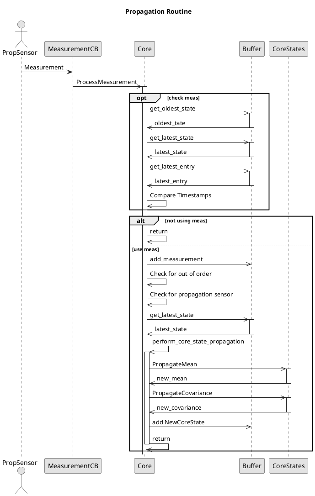

```plantuml
@startuml

skinparam monochrome true
title Propagation Routine

actor PropSensor
participant MeasurementCB
participant Core
participant Buffer
participant CoreStates

PropSensor->MeasurementCB: Measurement
MeasurementCB->>Core: ProcessMeasurement
activate Core

opt check meas
  Core->>Buffer++: get_oldest_state
  Buffer->>Core--: oldest_tate
  Core->>Buffer++: get_latest_state
  Buffer->>Core--: latest_state
  Core->>Buffer++: get_latest_entry
  Buffer->>Core--: latest_entry

  Core->>Core: Compare Timestamps
end

alt not using meas
  Core->>Core: return
else use meas
  Core->>Buffer: add_measurement
  Core->>Core: Check for out of order
  Core->>Core: Check for propagation sensor
  Core->>Buffer++: get_latest_state
  Buffer->>Core--: latest_state
  Core->>Core: perform_core_state_propagation

  activate Core
  Core->>CoreStates++: PropagateMean
  CoreStates->>Core--: new_mean
  Core->>CoreStates++: PropagateCovariance
  CoreStates->>Core--: new_covariance
  Core->>Buffer: add NewCoreState
  Core->>Core: return
  deactivate Core
end

'opt Normal Sensor
'  Core->>Sensor: Process Measurement
'end
' opt Propagation Sensor
'  Core->>CoreStates: Process Measurement
'end

@enduml
```
