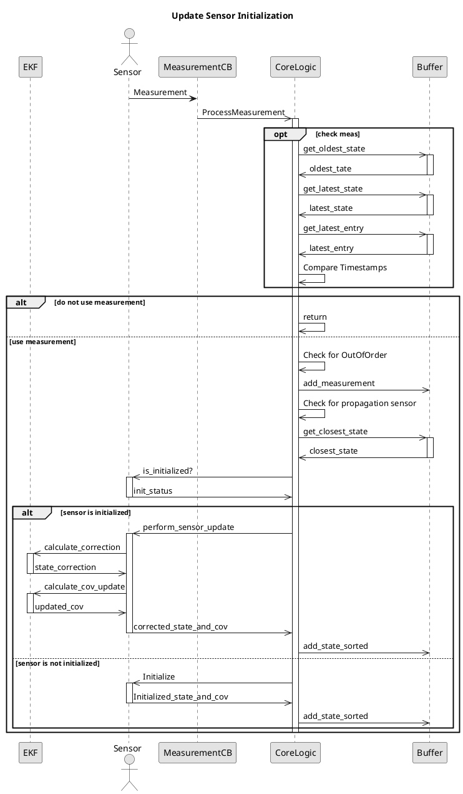

```plantuml
@startuml

skinparam monochrome true
title Update Sensor Initialization

participant EKF
actor Sensor
participant MeasurementCB
participant CoreLogic
participant Buffer

Sensor->MeasurementCB: Measurement
MeasurementCB->>CoreLogic: ProcessMeasurement

activate CoreLogic

opt check meas
  CoreLogic->>Buffer++: get_oldest_state
  Buffer->>CoreLogic--: oldest_tate
  CoreLogic->>Buffer++: get_latest_state
  Buffer->>CoreLogic--: latest_state
  CoreLogic->>Buffer++: get_latest_entry
  Buffer->>CoreLogic--: latest_entry
  CoreLogic->>CoreLogic: Compare Timestamps
end

alt do not use measurement
  CoreLogic->>CoreLogic: return
else use measurement
  CoreLogic->>CoreLogic: Check for OutOfOrder
  CoreLogic->>Buffer: add_measurement
  CoreLogic->>CoreLogic: Check for propagation sensor
  CoreLogic->>Buffer++: get_closest_state
  Buffer->>CoreLogic--: closest_state
  CoreLogic->>Sensor++: is_initialized?
  Sensor->>CoreLogic--: init_status

  alt sensor is initialized
    CoreLogic->>Sensor++: perform_sensor_update

    Sensor->>EKF++: calculate_correction
    EKF->>Sensor--: state_correction
    Sensor->>EKF++: calculate_cov_update
    EKF->>Sensor--: updated_cov

    Sensor->>CoreLogic--: corrected_state_and_cov
    CoreLogic->>Buffer: add_state_sorted

  else sensor is not initialized
    CoreLogic->>Sensor++: Initialize
    Sensor->>CoreLogic--: Initialized_state_and_cov
    CoreLogic->>Buffer: add_state_sorted
  end

  deactivate CoreLogic
end

@enduml
```
