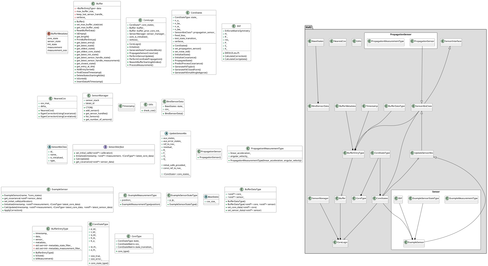

```plantuml
@startuml

skinparam class {
  BackgroundColor white
  ArrowColor black
  BorderColor black
}

package "MaRS" #DDDDDD {


SensorInterface <|-- SensorAbsClass
SensorAbsClass <|-- UpdateSensorAbs
UpdateSensorAbs o-- CoreStates

BufferMetadata --* BufferEntryType
BufferDataType --* BufferEntryType
SensorAbsClass --o BufferEntryType
Timestamp --* BufferEntryType

CoreStateType --* CoreType
BufferEntryType --o Buffer

CoreStates --o CoreLogic
Buffer --* CoreLogic
SensorManager --* CoreLogic
SensorAbsClass --o CoreStates
CoreStateType --* CoreStates


package PropagationSensor <<Rectangle>> #ffffff {
  PropagationSensor --|> SensorAbsClass
  class PropagationMeasurementType
}

package Sensor <<Rectangle>> #ffffff {
  class ExampleMeasurementType
  CoreStates --o ExampleSensor
  UpdateSensorAbs <|-down- ExampleSensor
  ExampleSensorStateType -down-* ExampleSensor
  EKF -down-* ExampleSensor
}

class Utils
class NearestCov

BaseStates --* BindSensorData


}

' MAIN CODE
enum BufferMetadata{
  core_state
  sensor_state
  init_state
  measurement
  measurement_ooo
}

class Buffer{
  - <BufferEntryType> data
  - max_buffer_size_
  - keep_last_sensor_handle_
  - verbose_

  + Buffer()
  + set_max_buffer_size(size)
  + get_max_buffer_size()
  + ResetBufferData()
  + IsEmpty()
  + get_length()
  + PrintBufferEntrys()
  + get_latest_entry()
  + get_latest_state()
  + get_oldest_state()
  + get_oldest_core_state()
  + get_latest_init_state()
  + get_latest_sensor_handle_state()
  + get_latest_sensor_handle_measurement()
  + get_closest_state()
  + get_entry_at_idx()
  + AddEntrySorted()
  + FindClosestTimestamp()
  + DeleteStatesStartingAtIdx()
  + IsSorted()
  + InsertDataAtTimestamp()
}

class CoreLogic{
  + CoreState*: core_states_
  + Buffer: buffer_
  + Buffer: buffer_prior_core_init_
  + SensorManager: sensor_manager_
  + core_is_initialized_
  + verbose_

  + CoreLogic()
  + Initialize()
  + GenerateStateTransitionBlock()
  + PropagateSensorCrossCov()
  + PerformSensorUpdate()
  + PerformCoreStatePropagation()
  + ReworkBufferStartingAtIndex()
  + ProcessMeasurement()

}

class CoreStates{
  + CoreStateType: state_
  + n_a_
  + n_ba_
  + n_w_
  + n_bw_
  + SensorAbsClass*: propagation_sensor_
  + fixed_bias_
  + test_state_transition_
  + verbose_
  + CoreStates()
  + set_propagation_sensor()
  + set_noise_std()
  + InitializeState()
  + InitializeCovariance()
  + PropagateState()
  + PredictProcessCovariance()
  + GenerateFdTaylor()
  + GenerateFdClosedForm()
  + GenerateFdSmallAngleApprox()
}

class EKF{
  + EKF(H,R,res,P)
  + CalculateCorrection()
  + CalculateCovUpdate()
  + EnforceMatrixSymmetry
  + H_
  + R _
  + res_
  + P_
  + S_
  + K_
}

class NearestCov{
+ cov_mat_
+ delta_
+ NearestCov()
+ EigenCorrectionUsingCovariance()
+ EigenCorrectionUsingCorrelation()
}

class SensorManager{
  + sensor_stack
  + latest_id
  + CTOR()
  + add_sensor()
  + get_sensor_handles()
  + list_Sensors()
  + get_number_of_sensors()
}

class Timestamp{

}

class Utils{
 + check_cov()
}

' SENSORS

class BindSensorData{
  + BaseStates: state_
  + cov_
  + BindSensorData()
}

abstract SensorAbsClass{
  + id_
  + name_
  + is_initialized_
  + type_
}

interface SensorInterface{
  + set_initial_calib(<void*> calibration)
  + Initialize(timestamp, <void*> measurement, <CoreType*> latest_core_data)
  + CalcUpdate()
  + get_covariance(<void*> sensor_data)
}

abstract UpdateSensorAbs{
  + aux_states_
  + aux_error_states_
  + ref_to_nav_
  + residual_
  + R_
  + F_
  + H_
  + Q_

  + initial_calib_provided_
  + const_ref_to_nav_

  + <CoreState>: core_states_
}

class PropagationSensor{
  + PropagationSensor()
}

class PropagationMeasurementType{
  + linear_acceleration_
  + angular_velocity_
  + PropagationMeasurementType(linear_acceleration, angular_velocity)
}


class ExampleSensor{
  + ExampleSensor(name, *core_states)
  + get_covariance(<void*>sensor_data)
  + set_initial_calib(calibration)
  + Initialize(timestamp, <void*>measurement, <CoreType> latest_core_data)
  + CalcUpdate(timestamp, <void*>measurement, <CoreType> latest_core_data, <void*> latest_sensor_data)
  + ApplyCorrection()
}

class ExampleMeasurementType{
+ position_
+ ExampleMeasurementType(position)
}


class ExampleSensorStateType{
  + p_ip_
  + ExampleSensorStateType()
}


' TYPE DEFINITIONS

abstract BaseStates{
  + cov_size_
}

class BufferDataType{
  + <void*> core_
  + <void*> sensor_

  + BufferDataType()
  + BufferDataType(<void*> core, <void*> sensor)
  + set_core_data(<void*> core)
  + set_sensor_data(<void*> sensor)
}

class BufferEntryType{
  + timestamp_
  + data_
  + sensor_
  + metadata_
  - std::set<int> metadata_state_filter_
  - std::set<int> metadata_measurement_filter_

  + BufferEntryType()
  + IsState()
  + IsMeasurement()

}

class CoreStateType{
  + core_state_type()
  + p_wi_
  + v_wi_
  + q_wi_
  + b_w_
  + b_a_

  + w_m_
  + a_m_

  + size_true_
  + size_error_
}

class CoreType{
  + CoreStateType state_
  + CoreStateMatrix cov_
  + CoreStateMatrix state_transition_

  + core_type()
}


@enduml
```
